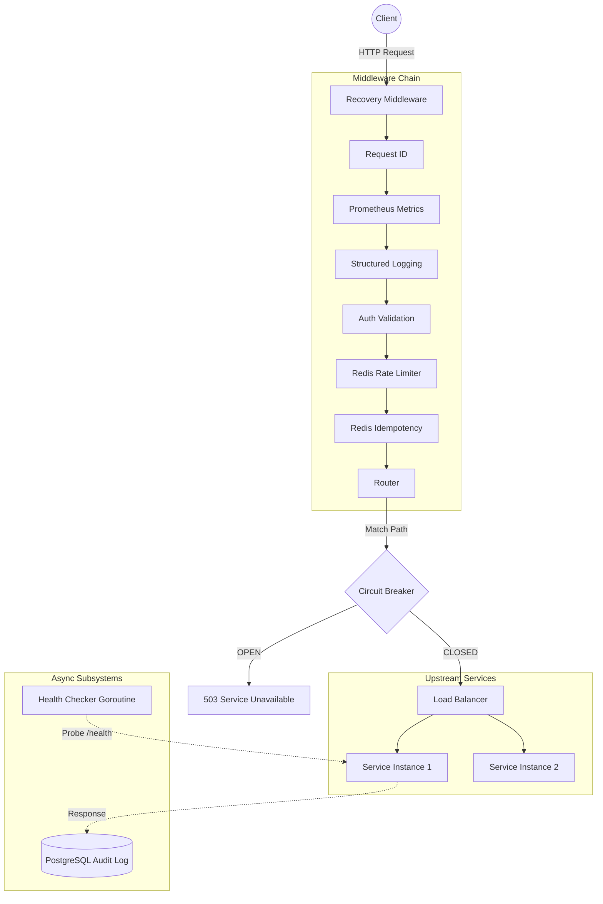

# Distributed API Gateway

A production-ready, high-performance distributed API Gateway written in Go. Designed to safely route microservice traffic with robust failure management, observability, and concurrency protection.

## Architecture



## Core Features

- **Intelligent Load Balancing**: Supports Pluggable Strategies:
  - `least-connections`: Adapts to heterogeneous backends by routing to the instance with the fewest in-flight requests.
  - `weighted-latency` (EWMA): Exponentially Weighted Moving Average to automatically route traffic to the fastest servers.
  - `round-robin`: Simple, fair distribution.
- **Resilience**: 
  - Finite State Machine **Circuit Breaker** (Closed -> Open -> Half-Open) to prevent cascading failures.
  - Background asynchronous Health Checks.
- **Traffic Control**:
  - Redis-backed Sliding Window **Rate Limiting** (preventing boundary burst issues seen in fixed-window).
  - **Idempotency**: Safely handles duplicate POST/PUT requests by caching downstream responses in Redis.
- **Observability**:
  - Async **Audit Logging**: Batched, non-blocking inserts to PostgreSQL.
  - Prometheus metrics exported at `/metrics`.
  - Structured JSON logging (`log/slog`).

## Getting Started

### 1-Click Local Deployment

The easiest way to run the API Gateway along with its dependencies (Redis, Postgres, Prometheus, Grafana, and Mock Upstreams) is via Docker Compose:

```bash
docker-compose -f docker/docker-compose.yml up --build -d
```

- **Gateway**: `http://localhost:8080`
- **Grafana Dashboard**: `http://localhost:3000` (admin/admin)
- **Admin API**: `http://localhost:9090` (Internal Pool Stats)

### Configuration Schema (`config/config.yaml`)

```yaml
server:
  port: 8080

routes:
  - path: /payments
    service: payments
    timeout: 15s
    rate_limit:
      requests_per_minute: 10 # Redis-backed Sliding Window

services:
  payments:
    upstreams:
      - http://payments-svc:9002
    health_check:
      path: /health
      interval: 10s
    balance_strategy: weighted-latency # ewma, least-connections, round-robin
```

## Running Tests

Unit and integration tests run entirely in Docker (or Podman).

```bash
go test -v -race ./...
```
*(Tests use `miniredis` to mock Redis Lua scripts locally without requiring an external container).*